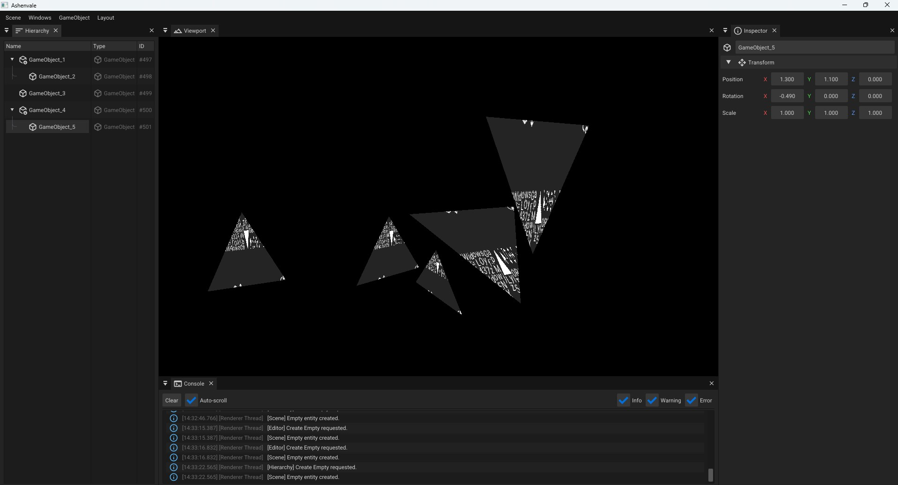

## Ashenvale

Ashenvale is a bindless, multi-threaded, glTF based DirectX 12 renderer serving as a sandbox for implementing advanced graphics techniques.

## Screenshots


## Features

## Prerequisites
- Windows SDK Latest
- CMake 3.30
- Shader Model 6.6

## Build
Make sure to have pre-requisites installed

```sh
# Clone the repo
git clone --recursive git@github.com:oistikbal/Ashenvale.git
cd Ashenvale

# Build CMake
mkdir build
cmake --build build --config Release

```

## Thirdparty

- [D3D12MA](https://github.com/GPUOpen-LibrariesAndSDKs/D3D12MemoryAllocator)
- [fastgltf](https://github.com/spnda/fastgltf)
- [WinPixEventRuntime](https://devblogs.microsoft.com/pix/winpixeventruntime/)
- [flecs](https://github.com/SanderMertens/flecs)
- [Dear ImGui](https://github.com/ocornut/imgui)

## References
- [VQEngine](https://github.com/vilbeyli/VQEngine)
- [LearnOpenGL](https://learnopengl.com/)

## License
This project is licensed under the [MIT License](LICENSE).